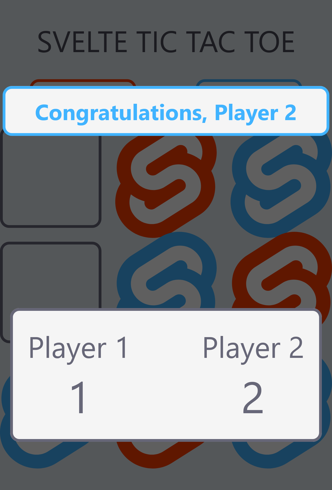

# svelte-tictactoe
## Purpose
Inspired by the tic tac toe game featured in the React tutorial, I thought I'd try out [Svelte](https://www.svelte.dev) by
creating my own tic tac toe game. As the purpose was to learn svelte, the app is fairly straight forward, lacking persistence
or a backend.

## Why svelte? 
After watching SvelteJS creator Rich Harris' presentation [Have Single-Page Apps Ruined the Web?](https://www.youtube.com/watch?v=860d8usGC0o&t=999s), I was
keen to take a break from React and try something different. The key difference between SvelteJS and React is that SvelteJS is more compiler than framework,
shifting the workload from the browser to the build stage. Instead of building the page in the browser, the SvelteJS compiler creates a real HTML pages and
ships just enough JS for them to be reactive. This results in smaller bundles, faster load time and better SEO.

## Developer experience
I was quite impressed with SvelteJS. Although it seems like an app would be better built in React, SvelteJS would be the ideal tool for projects that lay somewhere between app and website (like an online store, portal, dashboard etc). SvelteJS is a strong contender for the kinds of projects typically built
with traditional MVC frameworks, Rails, Django and even NextJS and Nuxt. Developers coming from frameworks using templating over JSX or pure JS might
also appreciate SvelteJS.

## Try it out
svelte-tictactoe is [available to try](https://tictactoe.jasont.dev/) and can be dowloaded from [Github](https://github.com/jasontdev/svelte-tictactoe).